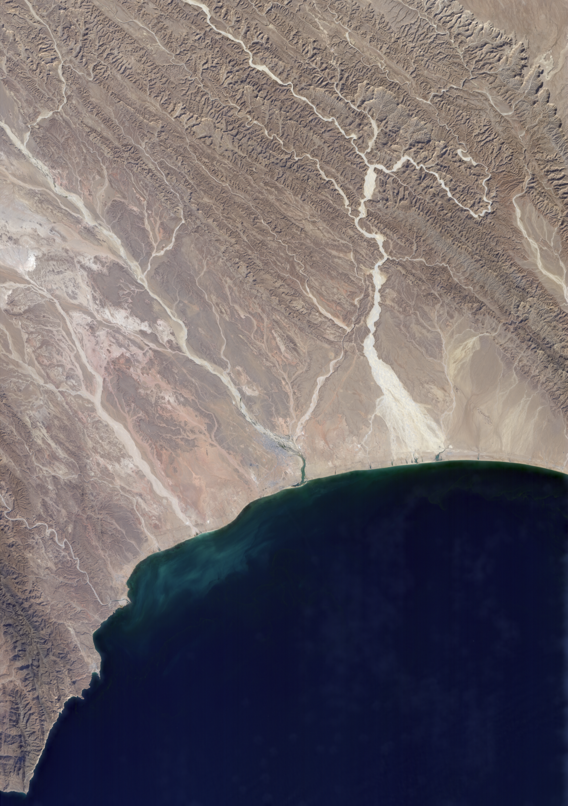
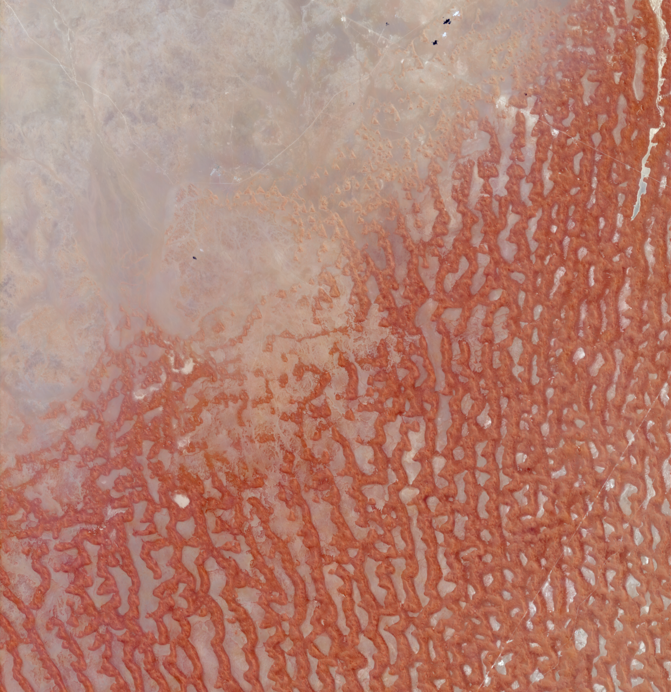
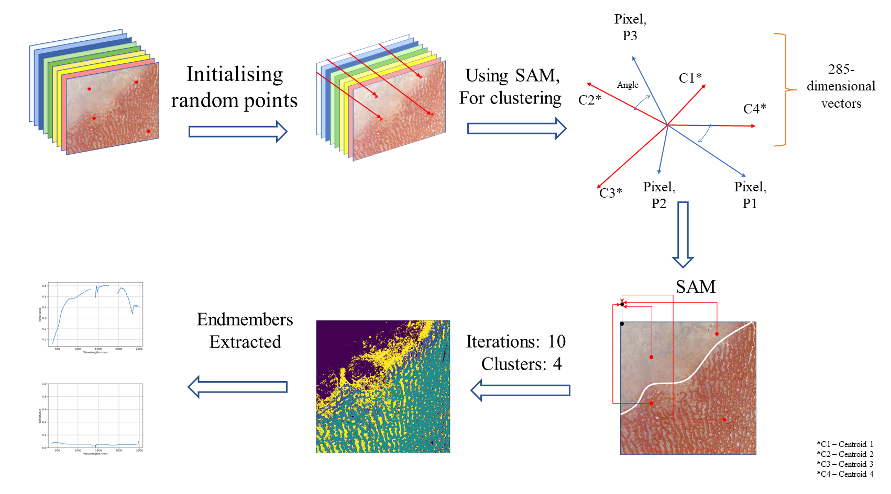

# Unsupervised Hyperspectral Image Segmentation: A Novel 3-Dimensional Clustering Methodology
This project uses unsupervised learning algorithm on the hyperspectral images obtained from the surface reflectance data from the Earth Surface Mineral Dust Source Investigation (EMIT) Imaging Spectrometer. The abundances extracted from the proposed unsupervised method have been illustrated as clusters of where a particular endmember is located in the region of interest. 
The subsequent processing steps utilise a proposed 3-dimensional unsupervised clustering algorithm and generate a map of differently classified areas. Furthermore, various modified silhouette indexes have been used to evaluate clustering, which in this research is 0.91.

## Dataset Description:
Hyperspectral images by EMIT Imaging Spectrometer cover various dust source regions of Earth. EMIT focuses on sunlit arid regions between 52°N latitude to 52°S latitude. The data consists of 285 bands, ranging from 381 nm to 2493 nm. The spectral resolution of the EMIT sensor is 7.5 nm, and its spatial resolution is 60 m. Hyperspectral images in this paper belong to EMIT’s Level 2A Estimated Surface Reflectance and Uncertainty and masks data product. Arid regions of Yemen’s desert and coast have been taken to execute the proposed methodology.

The true color images of the area of interest: 

## Methodology:
The algorithm groups pixels into designated N clusters by randomly selecting the first centroids of the image, corresponding N pixels, as unsupervised clustering references a for first iteration. This ensures the procedure is not biased when the clusters converge. A similarity score between each of the N centroids and each pixel in the image is computed using a spectral Angle Mapper (SAM), which takes the direction of the two pixels' spectral signatures into account. Simultaneously, each image pixel determines which centroid it is most comparable to, applying a label to the centroid that is most similar to a particular picture pixel and adding it to the list of points for that centroid. For every centroid, a pixel is assigned to the closest centroid. After the first epoch, a map of the categorized image is obtained, and the identified clusters of picture pixels are averaged out to get the cluster centers for each centroid. The procedure continues for a predetermined number of epochs, and the converged clusters create a spectral map with N unique spectral signatures that match the user's chosen clusters. So the proposed algorithm is a clustering methodology where the metric for comparison of cluster head is SAM.

The proposed algorithm:

The clustered images:
.png>)
.png>)

The spectral signatures for various clusters:

